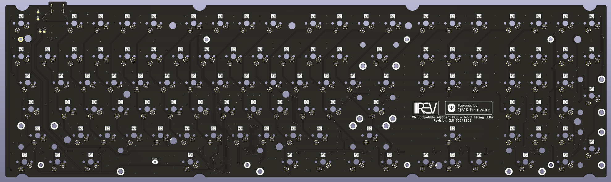
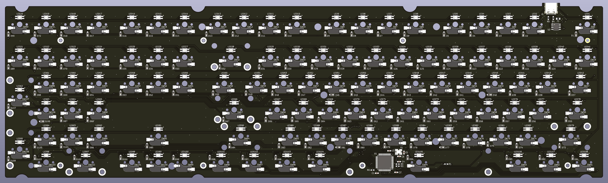

# Keychron V6 conversion

This project's goal is to convert a Keychron V6 Keybaord to north-facing LEDs.

It encompases:
* a pcb based on an ATMega32U4 that fits the V6 case and faceplate. These files are in the 'Hardware' folder.
* a qmk-based firmware for the ATMega32U4 powered 108 key V6. These files are in the 'Firmware' folder.

This was a fun project. I hope it can help someone that's doing something similar or just tinkering with
mechanical keyboards.

## Why

The south-facing LEDs weren't working for me. The light leaking under the keys blinded me when I typed with
low ambient light, and the key-legends were hardly vissible. I couldn't find keycaps for south-facing LEDs
that I really liked and I decided to try and design a new PCB as a fun side project.

## Disclaimer

**I'm not an electrical engineer**. These files are provided as is, without any warranty or liability. Please read
the license texts for full details.
